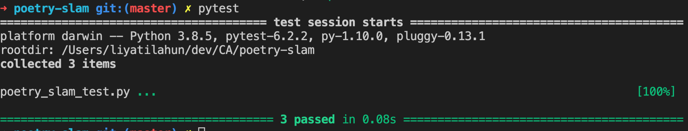

# How to use the test file to test your functions

## Download pytest

Enter the following command in your terminal:

> pip3 install pytest

> pip3 install coverage

## Getting Started with pytest

pytest works by finding test files and then running test classes and test functions in them. It finds the tests by searching in current folder and sub-folders for any files whose names starts or ends with  **\_test** or **test\_** respectively as follows:

1. test_*.py
2. *_test.py

To run the test file use the ```pytest``` command on your terminal.

```bash
> pytest
```

(you could also run, ```> pytest poetry_slam_test.py```)

After running the pytest command you should see something similar to this: 



If all of your function is passing, you will see green and passed. ✅

There could also be a chance that your functions are not passing the tests and you see something similar to the image below on your terminal. 🛑
The red color 🛑 here shows that there are functions that are not passing. But don't feel discouraged!
Test files are like hints and they are supposed to help and hint you towards a working function. 😄


# How to read test outputs

On the above image, we have seen that some of our test is failing. Now we will go through on how to read and detect which function is giving us an error. 🕵🏽‍♀️🕵🏽‍♂️

