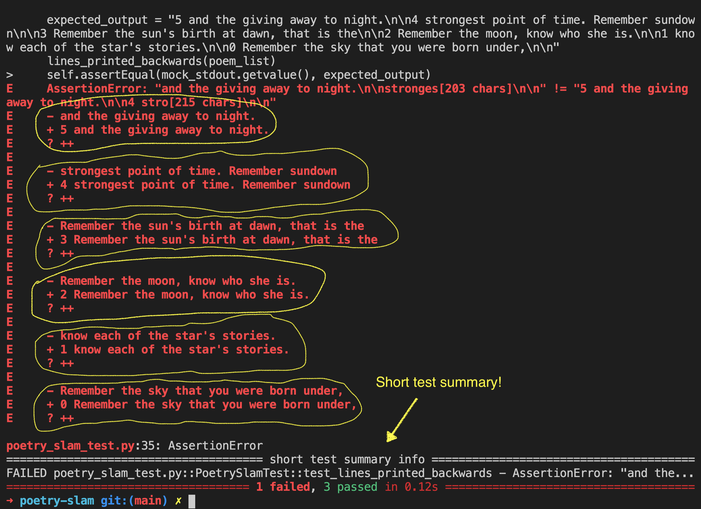

# How to use the test file to test your functions

## Download pytest

Enter the following command in your terminal:

> pip3 install pytest

> pip3 install coverage

## Getting Started with pytest

pytest works by finding test files and then running test classes and test functions in them. It finds the tests by searching in the current folder and sub-folders for any files whose names starts or ends with  **\_test** or **test\_** respectively as follows:

1. test_*.py 
  * For example: test_poetry_slam.py
2. *_test.py
  * For example: poetry_slam_test.py

To run the test file use the ```pytest``` command on your terminal.

```bash
> pytest
```

(you could also run, ```> pytest poetry_slam_test.py```)

After running the pytest command you should see something similar to this: 


If all of your functions are passing, you will see green and "passed". ✅

There could also be a chance that your functions are not passing the tests and you see something similar to the image below on your terminal. 🛑
The red color 🛑 here shows that there are functions that are not passing. But don't feel discouraged!
Test files are like hints and they are supposed to help and hint you towards a working function. 😄


## What is an assertion error? 🤔
An assertion error is caused when a program is run and the answer is the opposite of what was expected. For example, if we expect the output to be **True** but the result is **False**, we get an assertion error.

# How to read test outputs then fix errors



On the above image, we have seen that one of our tests is failing. Now we will go through on how to read and detect which function is giving us an error. 🕵🏽‍♀️🕵🏽‍♂️

The last section of the pytest error shows the short test summary info.
This info tells us which test function is not working. For example in the above image, it shows the ```test_lines_printed_backwards``` is the test that has an assertion error. 

From this information, we can then assume that the ```lines_printed_backwards()``` function is the one not working.

Let's walk through the example error output and look at the steps on identifying the bug and fixing it.

On the screenshot above, we see that there are 2 different versions for each line of the poem. These lines are prefixed with ```-``` or ```+``` sign. 
The ```-``` sign is to show that that line needs to be removed and replaced by the line with the ```+``` sign.

## For example: 
```
 - and the giving away to night.
 + 5 and the giving away to night.
```

The line that our program gave as output was  ```and the giving away to night.```. But this is the wrong output and our program needs to output  ```5 and the giving away to night.``` instead. 

We can see that the difference between the two lines is the number ```5```. 

Let's re-read the instruction for the ```lines_printed_backwards``` question again.

```
Create a function called lines_printed_backwards():
It should have 1 parameter called lines_list, which is a list of strings 
containing lines of your poem.
It should print the lines of the poem in reverse. Include the original line
number at the beginning of each line.
```

Based on the instructions, we need to add the original line number at the beginning of each line. 

From this, we can understand that our function ```lines_printed_backwards()``` is missing the line number at the beginning of each line and that's where our error is coming from. 

Let's go ahead and fix this bug! 🐞

After fixing the bug, test your functions again using the ```pytest``` command. You should be able to see your tests run without an error message. 


#
## Resources
[SPD2.3 Pytest tutorial](https://github.com/Make-School-Courses/SPD-2.31-Testing-and-Architecture/tree/master/lab/pytest)